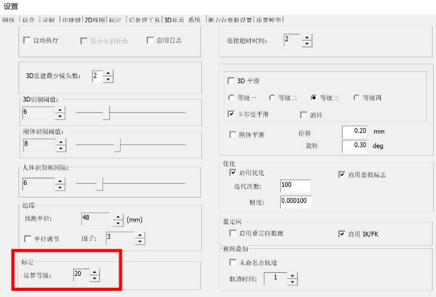

# NOKOV

动捕系统的使用过程中经常出现一些问题，这里罗列动捕使用过程的一些经验。

## 1. 硬件问题

### 1.1 镜头连接问题

- 插上动捕的**电源线**之后，检查所有的镜头是否都亮起，都亮起来说明电源连接没有问题
- 如果有**镜头没有亮灯**，需要顺着镜头的线检查是不是**接触不良**
- 如果镜头全亮灯，但是某个**镜头中看不到信息**，需要顺着镜头线**检查网线接口**是不是连接不良，动捕每个镜头连接线的中间 电源线 和 信号线 是分开的
- 如果上述检查没有问题，但是镜头看不到，可以尝试**重启软件或者动捕系统**

### 1.2 实验场地问题

- 镜头 **2D 图像** 噪声多且变化 或者 视野只能看到一半，可能是**镜头前有障碍物遮挡**
- 标定好动捕系统之后，在向水里放机器人时，**不要让机器人碰到动捕的架子**
- 环境的灯光对动捕镜头的灯光会有一些影响，使**周围环境的光线昏暗**更利于动捕实验
- **抽水泵**偶尔会出现问题，没插电源时也有**把少许的水池中的水排出去**，做实验时最好把抽水泵拿出水池之外

## 2. 标定过程问题

### 2.1 镜头灯亮度

新的镜头灯光只需要设置到 **20-30%** 左右**光的强度**就足够，太高会使一些容易反光的地方产生噪点

### 2.2 放置 L 型杆设置阈值

把 L 型杆放置在水池中间时，要把 L 型杆分别放在靠近两边的地方调整一下两边的镜头阈值，因为只放在中间可能有些镜头看不到

### 2.3 T型杆更新标定

- 在点击 T 型杆标定的 `next` 之后，动捕系统检测到 T 型杆上的小球才会开始采集数据
- 挥杆时尽量平着挥杆，尽量不要让杆子挡住小球
- 挥杆的时间越长，采集的数据越多，动捕系统计算到收敛的所需要的迭代次数越久，如下图中的红框，数据越多导致算的不收敛时可以提高运算等级

